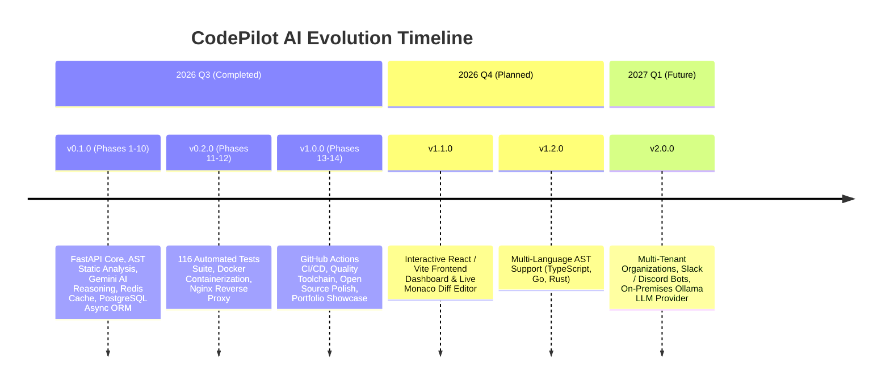

# CodePilot AI — Product Roadmap

This document outlines the strategic evolution, architectural roadmap, and future milestones for **CodePilot AI**.

---

## 🎯 Release Milestones Overview

---

## ✅ Completed Milestones (Phases 1–14 — v1.0.0)

### 1. Core Static Code Analysis & AST Parser
- [x] Syntax-error resilient AST parser with line-by-line recovery.
- [x] Cyclomatic Complexity, Halstead volume & difficulty, Maintainability Index (MI Rank A-F).
- [x] Bandit-style security checks (eval, SQL injection, hardcoded secrets, weak cryptographic hashes).
- [x] PEP 8 style heuristics, naming conventions, docstring coverage, and weighted quality scoring rubric (0–100).

### 2. Multi-Modal AI Reasoning & Generators (Google Gemini 2.5 Flash)
- [x] Deep semantic code review, strengths, critical vulnerabilities, and improvement roadmaps.
- [x] Beginner and executive code execution explanations.
- [x] Algorithmic time/space complexity optimization suggestions.
- [x] Automated bug diagnosis with code patch generation.
- [x] 8 specialized generators: technical documentation, Google/Sphinx docstrings, pytest test suites, GitHub READMEs, refactoring proposals, system architecture specs, changelogs, and executive summaries.

### 3. Asynchronous Enterprise Infrastructure
- [x] Asynchronous SQLAlchemy 2.0 ORM with PostgreSQL and 6 Alembic database migrations.
- [x] Dual JWT OAuth2 authentication + cryptographically hashed API Keys.
- [x] In-memory fallback Redis caching pool and SlowAPI token rate limiting.
- [x] Prometheus metrics collector (`/metrics`) and HMAC-SHA256 signed outbound webhooks.
- [x] ZIP archive project scanner with recursive package detection and tree visualization.
- [x] Multi-format reporting engine: JSON, Markdown, styled responsive HTML, and ZIP bundles.

### 4. Containerization & DevOps (Phases 11–13)
- [x] 116 automated tests covering unit, integration, security, and performance benchmarks.
- [x] Production multi-stage Docker build (`python:3.13-slim`), Docker Compose dev and prod profiles.
- [x] Nginx reverse proxy with gzip compression, security headers, and rate limiting.
- [x] 7 GitHub Actions workflows (`ci.yml`, `tests.yml`, `lint.yml`, `security.yml`, `docker.yml`, `release.yml`, `deploy.yml`).
- [x] Pre-commit hooks (`.pre-commit-config.yaml`), Dependabot, and PowerShell automation helpers.

---

## 🔮 Upcoming Milestones (v1.1.0 – v1.3.0)

### 🖥️ Frontend Dashboard & Web Interface (v1.1.0)
- [ ] **React 18 + Vite Web App**: Clean, modern dark-mode dashboard with responsive layout.
- [ ] **Monaco Code Editor**: Live syntax highlighting with inline error squiggles and code suggestions.
- [ ] **Side-by-Side Review Diff Viewer**: GitHub-style split view showing original code vs suggested refactored code.
- [ ] **Interactive Metrics Visualizations**: Recharts/Chart.js graphs for historical score progression, language breakdown, and 365-day GitHub-style heatmap.
- [ ] **Web Drag-and-Drop Uploader**: Direct browser upload for single files and `.zip` repositories with live progress bars.

### 🌐 Multi-Language AST Analysis (v1.2.0)
- [ ] **TypeScript / JavaScript**: Tree-sitter AST parser detecting prototype pollution, eval, and ESLint rule violations.
- [ ] **Go (Golang)**: AST parser analyzing goroutine leaks, unhandled errors, and cyclomatic complexity.
- [ ] **Rust**: Clippy and security audit heuristics integration.

### 🔌 Developer Tooling & Integrations (v1.3.0)
- [ ] **GitHub Pull Request Bot**: Automated GitHub App posting review comments directly onto PR diffs.
- [ ] **VS Code Extension**: Direct in-editor code review command highlighting issues in real-time.
- [ ] **CLI Tool (`codepilot-cli`)**: Terminal utility for running local audits (`codepilot review ./src`).

---

## 🏢 Enterprise & Team Features (v2.0.0+)

### 👥 Team Collaboration & Multi-Tenancy
- [ ] Multi-user organizations, workspace isolation, and team leaderboards.
- [ ] Review assignment workflows and approval gates.
- [ ] Slack, Discord, and Microsoft Teams review notification webhooks.

### 🛡️ Enterprise Security & Self-Hosted AI
- [ ] SAML 2.0 / Okta / Azure AD Single Sign-On (SSO).
- [ ] **Local LLM Provider**: Pluggable provider for self-hosted models via Ollama or vLLM (Llama 3, DeepSeek-Coder, Qwen-2.5-Coder) for air-gapped enterprise environments.
- [ ] S3 / Google Cloud Storage backend for permanent artifact and audit trail archiving.
