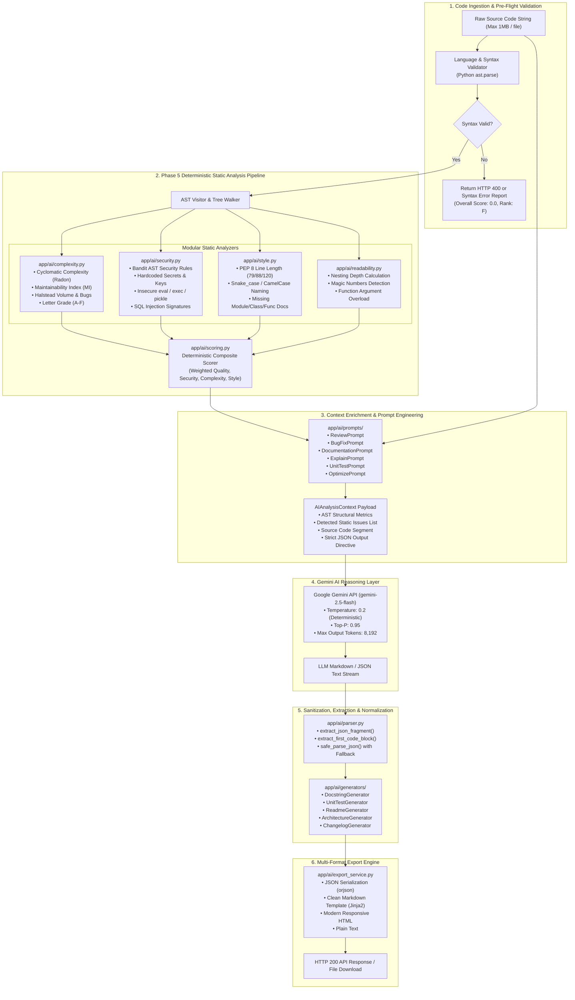
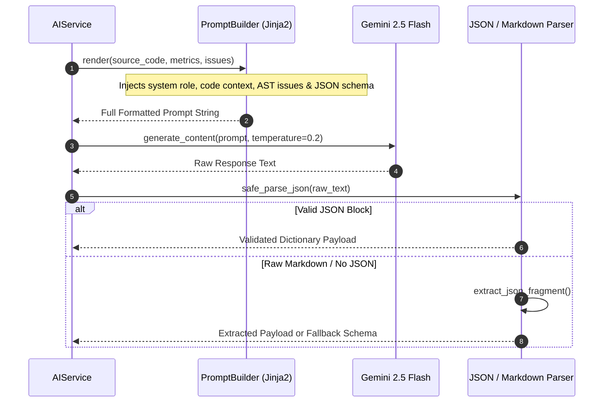

# CodePilot AI — AI Pipeline & Static Analysis Architecture

## 1. Executive Summary

**CodePilot AI** combines deterministic static analysis with Large Language Model (LLM) contextual reasoning. The pipeline ensures zero hallucinations on syntactical metrics, complexity limits, and known security vulnerability signatures by computing them directly on the Python Abstract Syntax Tree (AST), while leveraging **Google Gemini 2.5 Flash** for high-level architectural evaluation, idiomatic recommendations, docstring synthesis, and automated test suite generation.

---

## 2. End-to-End AI & Analysis Flowchart

---

## 3. Phase 5 Deterministic Static Analysis Pipeline

The static analyzer lives in `app/ai/` and operates strictly on the compiled AST without executing user code.

### 3.1 Cyclomatic Complexity & Maintainability (`complexity.py`)
* **Cyclomatic Complexity (CC)**: Measures the number of linearly independent paths through the program using Radon's visitor algorithm.
  * `1 - 5`: Grade **A** (Low risk, clean function)
  * `6 - 10`: Grade **B** (Moderate risk)
  * `11 - 20`: Grade **C** (High complexity, refactoring recommended)
  * `21+`: Grade **F** (Extreme complexity, critical risk)
* **Maintainability Index (MI)**: Computes a logarithmic scale from 0 to 100 based on Halstead volume, cyclomatic complexity, and lines of code:
  $$\text{MI} = \max\left(0, \frac{171 - 5.2 \ln(V) - 0.23 (CC) - 16.2 \ln(\text{LOC})}{171} \times 100\right)$$

### 3.2 AST Security Auditing (`security.py`)
Scans AST nodes against a suite of 25+ AST inspection rules:
* **Secrets in Code**: Detects high-entropy strings, AWS tokens (`AKIA...`), JWT strings, GitHub tokens, and database passwords assigned to literals.
* **Insecure Calls**: Flags dangerous primitives such as `eval()`, `exec()`, `input()`, `pickle.loads()`, `yaml.load(Loader=Loader)`.
* **Injection Signatures**: Identifies unparameterized SQL queries via string formatting or `%` interpolation within database call nodes.
* **Path Traversal**: Flags raw file openings without directory whitelisting or sanitization.

### 3.3 Style & PEP 8 Conformance (`style.py`)
* Analyzes line length thresholds (configurable: 79, 88, 120 characters).
* Enforces naming conventions: `snake_case` for functions/variables, `PascalCase` for classes, and `UPPER_SNAKE_CASE` for module constants.
* Identifies missing docstrings on public modules, classes, and exported functions.

### 3.4 Readability & Nesting Depth (`readability.py`)
* Evaluates indentation nesting depth (flags blocks nested > 4 levels deep).
* Identifies unnamed magic numeric and string literals outside configuration files.
* Checks function signatures for excessive parameter counts (> 5 arguments).

---

## 4. Google Gemini 2.5 Flash Integration

### 4.1 Client Configuration
The integration uses Google's `google-genai` SDK configured via `app/core/config.py`:
* **Model**: `gemini-2.5-flash`
* **Temperature**: `0.2` (Prioritizes deterministic reasoning over creative variance)
* **Top-P**: `0.95`
* **Max Output Tokens**: `8,192`
* **Timeout**: 30.0 seconds with exponential retry backoff (3 attempts).

### 4.2 Graceful Degradation & Mock Fallback
When running offline, in test suites, or if Gemini API quota is exhausted:
* The system detects failure in `app/ai/providers/gemini_provider.py`.
* Automatically falls back to deterministic rule-based advice compiled directly from the AST metrics.
* Ensures the API never crashes with a 500 error due to external network or quota limits.

---

## 5. Prompt Engineering & Flow

Every prompt is modularized under `app/ai/prompts/` and formatted with structured constraints.

### Prompt Directory:
1. `review_prompt.py`: Instructs Gemini to evaluate architecture, performance, modularity, and security, outputting structured JSON with `summary`, `strengths`, `recommendations`, and `bugfix`.
2. `bugfix_prompt.py`: Solicits direct diff patches targeting the highest-severity security and bug issues.
3. `documentation_prompt.py`: Produces comprehensive Sphinx / Google-style docstrings and module documentation.
4. `explain_prompt.py`: Breaks down complex algorithms for junior developers, explaining time and space complexity ($O(n)$ notation).
5. `unittest_prompt.py`: Generates complete, executable `pytest` test suites with fixtures, parameterization, and edge-case assertions.
6. `optimize_prompt.py`: Pinpoints CPU and memory bottlenecks with optimized refactored alternatives.

---

## 6. Code & Artifact Generators

Located in `app/ai/generators/`, each generator takes the AST and Gemini findings to assemble production deliverables:

1. **`docstring_generator.py`**: Injects formatted Google-style docstrings directly into the source code AST, aligning parameters, return types, and exceptions.
2. **`unittest_generator.py`**: Assembles clean `pytest` test files ready for execution, covering happy paths, boundary values, and exception handling.
3. **`readme_generator.py`**: Generates a complete project `README.md` with badges, installation, API usage examples, and architecture overview.
4. **`architecture_generator.py`**: Evaluates system component dependencies and produces Mermaid diagram code representing the codebase structure.
5. **`changelog_generator.py`**: Produces a `CHANGELOG.md` segment conforming to the *Keep a Changelog* standard.
6. **`refactor_generator.py`**: Delivers a fully refactored, idiomatic replacement of the submitted code.

---

## 7. Multi-Format Export Engine

The export engine (`app/ai/export_service.py`) transforms analysis results into multiple downloadable formats:

| Format | Implementation | Characteristics |
| :--- | :--- | :--- |
| **JSON** | `orjson.dumps()` | High-performance, schema-validated JSON payload |
| **Markdown** | `markdown_formatter.py` | GitHub-Flavored Markdown with tables, alerts, and code fences |
| **HTML** | `html_formatter.py` | Standalone responsive HTML with CSS styles, dark mode, and syntax highlighting |
| **Plain Text** | `to_plain_text()` | Clean ASCII stripped of markdown tokens for terminal output |

---

*Document Version: 1.0.0 — AI Pipeline Specification.*
