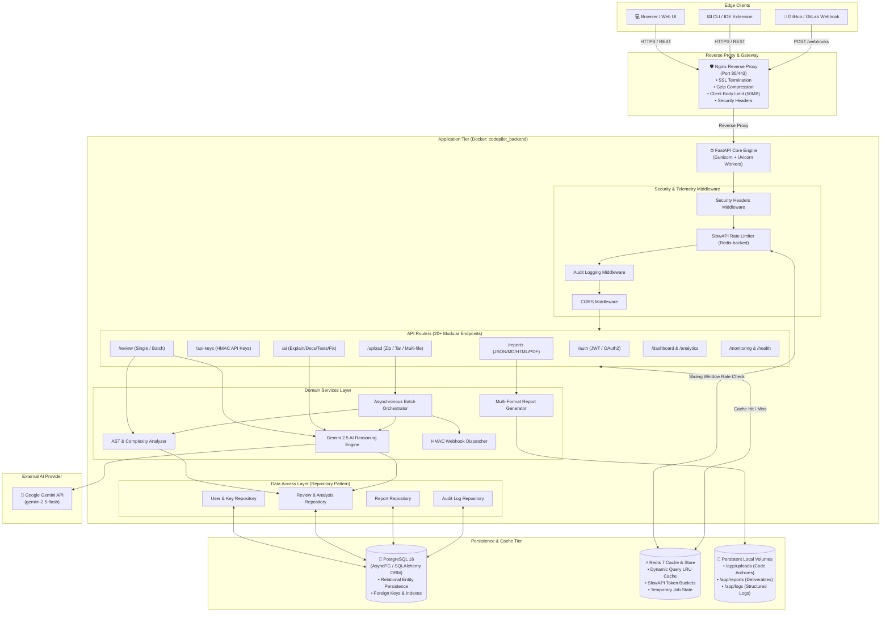
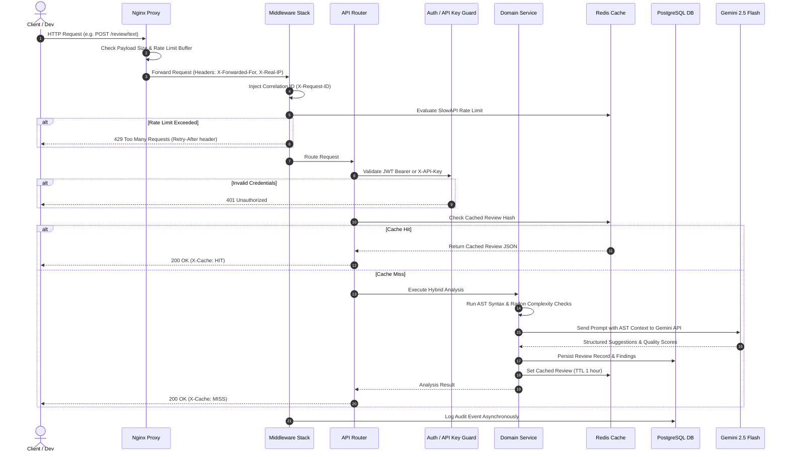
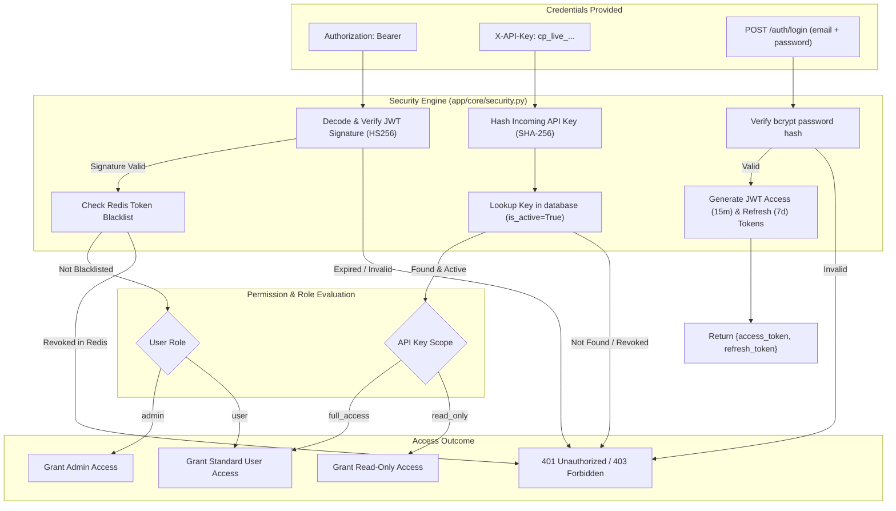
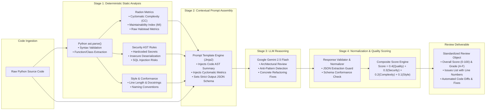
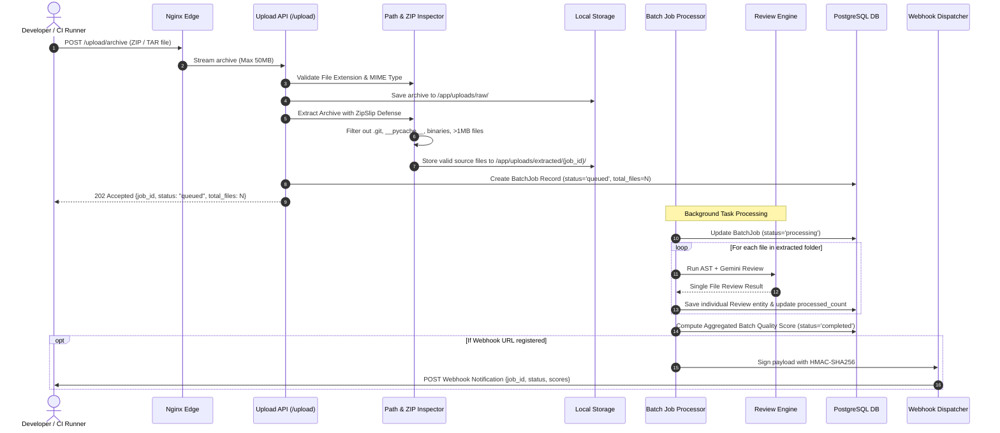
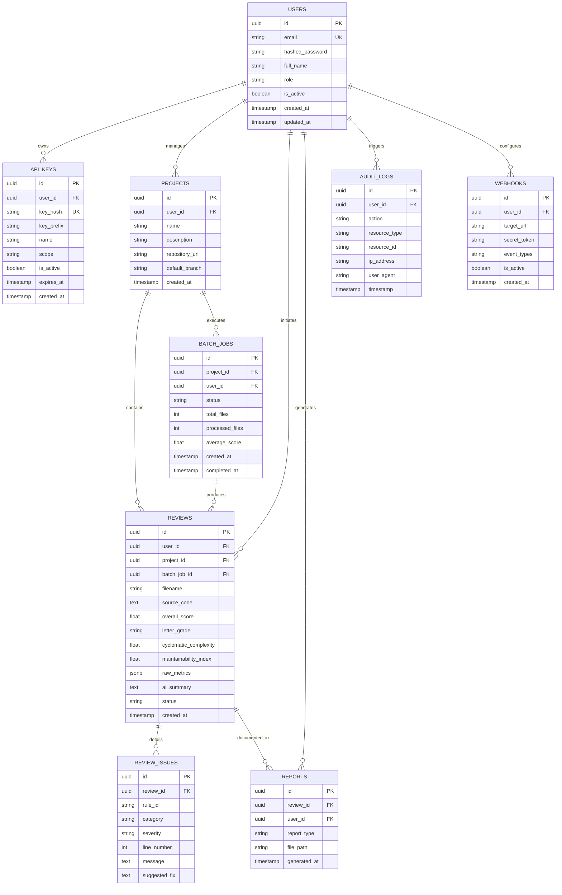
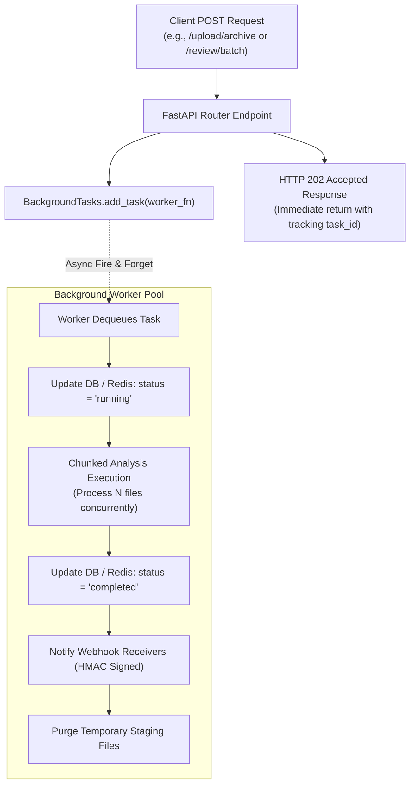
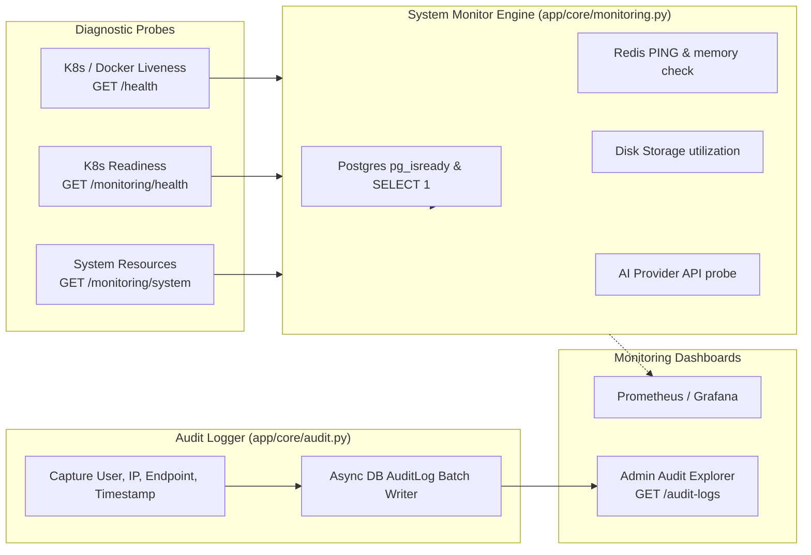

# CodePilot AI — System Architecture Specification

## 1. Executive Architecture Overview

**CodePilot AI** is an enterprise-ready, hybrid static-analysis and Generative AI code review orchestration platform. It integrates deterministic AST parsing, cyclomatic complexity calculations (Radon), AST-level security auditing (Bandit), and PEP 8 conformance checking with high-reasoning Large Language Models (Google Gemini 2.5 Flash).

The backend is built on **FastAPI (Python 3.13)** with an asynchronous I/O paradigm, backed by **PostgreSQL 16** for relational state persistence, **Redis 7** for LRU caching and distributed rate limiting, and **Nginx** as an edge reverse proxy providing TLS termination, Gzip compression, and request buffering.



---

## 2. Request Lifecycle

Every HTTP transaction flows through strict authentication, rate-limiting, audit-tracking, and error-handling filters before reaching domain controllers.



---

## 3. Authentication & Authorization Flow

CodePilot AI supports dual authentication schemes: **JWT (JSON Web Tokens)** for interactive web users and **HMAC Hashed API Keys** for CI/CD pipelines and programmatic agents.



---

## 4. AI Review Engine Pipeline

The AI analysis pipeline utilizes a multi-phase approach: deterministic Python Abstract Syntax Tree (AST) inspection evaluates mechanical correctness and complexity first, after which context-rich prompts feed the LLM to deliver architectural critique.



---

## 5. Upload & Batch Analysis Processing Flow



---

## 6. Database Entity-Relationship Model



---

## 7. Background Task Execution Architecture

CodePilot AI utilizes asynchronous non-blocking background task workers managed through FastAPI's `BackgroundTasks` orchestration and Redis tracking.



---

## 8. Caching Strategy & Invalidation Flow

CodePilot AI uses Redis 7 as an intelligent multi-layer cache:

1. **Deterministic Review Cache**: Python source codes are normalized and hashed via SHA-256. If identical code is reviewed again with identical parameters, results are returned in <2ms.
2. **Dashboard & Analytics Cache**: Complex aggregate SQL queries across thousands of historical reviews are cached for 5 minutes.
3. **Session & Rate-Limit Tracking**: Token bucket sliding windows prevent API abuse.

```mermaid
flowchart TD
    StartCheck["Incoming Request (GET /review/{id} or POST /review/text)"]
    ComputeKey["Calculate Cache Key\n(Key: review:{sha256_hash} or analytics:{user_id})"]
    QueryRedis["Query Redis Cache Engine"]
    
    HitCheck{"Cache Key Exists?"}
    ReturnCached["Retrieve Deserialized JSON from Redis\nInject X-Cache: HIT Header\nReturn Response (<2ms)"]
    
    ExecuteQuery["Execute AST Pipeline / Query PostgreSQL Database"]
    StoreRedis["Serialize Output to JSON\nSet Redis Key with TTL (e.g. 3600s)\nInject X-Cache: MISS Header"]
    ReturnFresh["Return Newly Computed Result"]

    StartCheck --> ComputeKey
    ComputeKey --> QueryRedis
    QueryRedis --> HitCheck
    HitCheck -->|Yes (HIT)| ReturnCached
    HitCheck -->|No (MISS)| ExecuteQuery
    ExecuteQuery --> StoreRedis
    StoreRedis --> ReturnFresh
```

---

## 9. Observability, Monitoring & Audit Flow



---

*Document Version: 1.0.0 — Phase 14 Complete Architecture Specification.*
