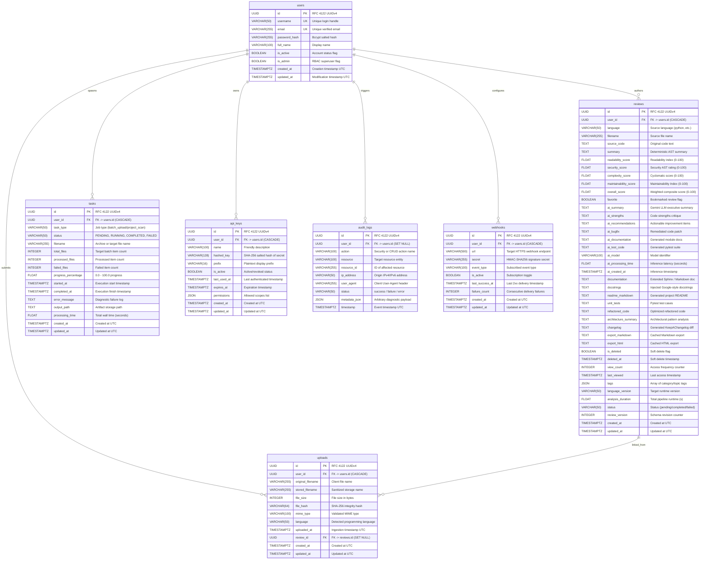

# CodePilot AI — Database Schema Specification

## 1. Overview & Architecture

**CodePilot AI** uses **PostgreSQL 16** as its primary relational datastore with **SQLAlchemy 2.0 (AsyncIO)** and **Asyncpg** driver. All migrations are tracked and version-controlled via **Alembic**.

### Key Design Tenets
1. **Primary Keys**: 128-bit RFC 4122 Version 4 UUIDs (`uuid.UUID`) across all domain entities, eliminating integer sequence enumeration attacks.
2. **Timestamps**: Consistent UTC timezone-aware timestamps (`created_at`, `updated_at`) automatically maintained via declarative mixins (`TimestampMixin`).
3. **Cascading Integrity**: Child tables enforce referential integrity (`ON DELETE CASCADE` for user-owned tasks, reviews, uploads, api_keys, webhooks; `ON DELETE SET NULL` for audit logs and optional upload-to-review links).
4. **Optimized Indexing**: B-tree indexing applied on all lookup columns, composite query paths, foreign keys, status flags, and soft-delete filters (`is_deleted`).
5. **JSONB Flexibility**: Structured metadata (e.g. audit telemetry, API key scopes, review tags) stored using native PostgreSQL JSON types.

---

## 2. Mermaid Entity-Relationship (ER) Diagram



---

## 3. Data Dictionary & Table Definitions

### 3.1 `users`
Primary user table storing credentials, authentication parameters, and role-based permissions.

| Column | Type | Nullable | Default | Constraints & Indexes | Description |
| :--- | :--- | :--- | :--- | :--- | :--- |
| `id` | `UUID` | No | `uuid_generate_v4()` | Primary Key | RFC 4122 UUIDv4 identifier |
| `username` | `VARCHAR(50)` | No | — | Unique, Index (`ix_users_username`) | Unique user handle |
| `email` | `VARCHAR(255)` | No | — | Unique, Index (`ix_users_email`) | Unique RFC 5322 email address |
| `password_hash` | `VARCHAR(255)` | No | — | — | Bcrypt-hashed password (12 rounds) |
| `full_name` | `VARCHAR(100)` | Yes | `NULL` | — | User's full name |
| `is_active` | `BOOLEAN` | No | `TRUE` | — | Controls login availability |
| `is_admin` | `BOOLEAN` | No | `FALSE` | — | Grants administrative privileges |
| `created_at` | `TIMESTAMPTZ` | No | `NOW()` | — | Account creation timestamp |
| `updated_at` | `TIMESTAMPTZ` | No | `NOW()` | — | Profile modification timestamp |

---

### 3.2 `reviews`
Core entity storing code analysis metrics, AST calculations, and Gemini AI outputs.

| Column | Type | Nullable | Default | Constraints & Indexes | Description |
| :--- | :--- | :--- | :--- | :--- | :--- |
| `id` | `UUID` | No | `uuid_generate_v4()` | Primary Key | Review record identifier |
| `user_id` | `UUID` | No | — | FK `users.id` ON DELETE CASCADE, Index | Review author / owner |
| `language` | `VARCHAR(50)` | No | — | Index (`ix_reviews_language`) | Programming language |
| `filename` | `VARCHAR(255)` | No | — | — | Source code file name |
| `source_code` | `TEXT` | No | — | — | Full raw source code analyzed |
| `summary` | `TEXT` | Yes | `NULL` | — | Deterministic AST static summary |
| `readability_score` | `FLOAT` | Yes | `NULL` | — | Readability score (0.0 to 100.0) |
| `security_score` | `FLOAT` | Yes | `NULL` | — | Security & safety score (0.0 to 100.0) |
| `complexity_score` | `FLOAT` | Yes | `NULL` | — | Cyclomatic complexity rating |
| `maintainability_score` | `FLOAT` | Yes | `NULL` | — | Radon maintainability score |
| `overall_score` | `FLOAT` | Yes | `NULL` | — | Composite weighted score |
| `favorite` | `BOOLEAN` | No | `FALSE` | Index (`ix_reviews_favorite`) | User favorite / bookmark toggle |
| `ai_summary` | `TEXT` | Yes | `NULL` | — | High-level Gemini review summary |
| `ai_strengths` | `TEXT` | Yes | `NULL` | — | Noted strengths and patterns |
| `ai_recommendations` | `TEXT` | Yes | `NULL` | — | Concrete suggested improvements |
| `ai_bugfix` | `TEXT` | Yes | `NULL` | — | Automated AI bugfix / diff |
| `ai_documentation` | `TEXT` | Yes | `NULL` | — | AI generated documentation |
| `ai_test_code` | `TEXT` | Yes | `NULL` | — | AI generated pytest test suite |
| `ai_model` | `VARCHAR(100)` | Yes | `NULL` | — | Model ID (e.g. `gemini-2.5-flash`) |
| `ai_processing_time` | `FLOAT` | Yes | `NULL` | — | LLM inference latency (seconds) |
| `ai_created_at` | `TIMESTAMPTZ` | Yes | `NULL` | — | AI inference completion time |
| `documentation` | `TEXT` | Yes | `NULL` | — | Full API / component documentation |
| `docstrings` | `TEXT` | Yes | `NULL` | — | Injected Google-format docstrings |
| `readme_markdown` | `TEXT` | Yes | `NULL` | — | Standalone generated README |
| `unit_tests` | `TEXT` | Yes | `NULL` | — | Generated test suite code |
| `refactored_code` | `TEXT` | Yes | `NULL` | — | Refactored source code |
| `architecture_summary` | `TEXT` | Yes | `NULL` | — | Software architecture evaluation |
| `changelog` | `TEXT` | Yes | `NULL` | — | Keep a Changelog diff markdown |
| `export_markdown` | `TEXT` | Yes | `NULL` | — | Cached export in Markdown format |
| `export_html` | `TEXT` | Yes | `NULL` | — | Cached export in HTML format |
| `is_deleted` | `BOOLEAN` | No | `FALSE` | Index (`ix_reviews_is_deleted`) | Soft delete flag |
| `deleted_at` | `TIMESTAMPTZ` | Yes | `NULL` | — | Soft deletion timestamp |
| `view_count` | `INTEGER` | No | `0` | — | Total view count counter |
| `last_viewed` | `TIMESTAMPTZ` | Yes | `NULL` | — | Last accessed timestamp |
| `tags` | `JSON` | Yes | `'[]'` | — | Categorical search tags |
| `language_version` | `VARCHAR(50)` | Yes | `NULL` | — | Python version (e.g. `3.13`) |
| `analysis_duration` | `FLOAT` | Yes | `NULL` | — | Total analysis duration (s) |
| `status` | `VARCHAR(50)` | No | `'completed'` | Index (`ix_reviews_status`) | Review lifecycle status |
| `review_version` | `INTEGER` | No | `1` | — | Schema version |
| `created_at` | `TIMESTAMPTZ` | No | `NOW()` | — | Record creation time |
| `updated_at` | `TIMESTAMPTZ` | No | `NOW()` | — | Record modification time |

---

### 3.3 `tasks`
Tracks asynchronous batch operations, archive analyses, and background jobs.

| Column | Type | Nullable | Default | Constraints & Indexes | Description |
| :--- | :--- | :--- | :--- | :--- | :--- |
| `id` | `UUID` | No | `uuid_generate_v4()` | Primary Key | Task identifier |
| `user_id` | `UUID` | No | — | FK `users.id` ON DELETE CASCADE, Index | Initiating user |
| `task_type` | `VARCHAR(50)` | No | `'batch_upload'` | — | Job type identifier |
| `status` | `VARCHAR(50)` | No | `'PENDING'` | Index (`ix_tasks_status`) | PENDING, RUNNING, COMPLETED, FAILED |
| `filename` | `VARCHAR(255)` | Yes | `NULL` | — | Associated file or batch name |
| `total_files` | `INTEGER` | No | `0` | — | Total files in target batch |
| `processed_files` | `INTEGER` | No | `0` | — | Count of completed files |
| `failed_files` | `INTEGER` | No | `0` | — | Count of failed files |
| `progress_percentage` | `FLOAT` | No | `0.0` | — | Normalized percentage (0-100) |
| `started_at` | `TIMESTAMPTZ` | Yes | `NULL` | — | Execution start time |
| `completed_at` | `TIMESTAMPTZ` | Yes | `NULL` | — | Execution completion time |
| `error_message` | `TEXT` | Yes | `NULL` | — | Stack trace or failure reason |
| `output_path` | `TEXT` | Yes | `NULL` | — | Stored batch report location |
| `processing_time` | `FLOAT` | Yes | `NULL` | — | Wall clock duration (s) |
| `created_at` | `TIMESTAMPTZ` | No | `NOW()` | — | Job submission time |
| `updated_at` | `TIMESTAMPTZ` | No | `NOW()` | — | Job state update time |

---

### 3.4 `uploads`
Records user-submitted source files, code snippets, and archive bundles.

| Column | Type | Nullable | Default | Constraints & Indexes | Description |
| :--- | :--- | :--- | :--- | :--- | :--- |
| `id` | `UUID` | No | `uuid_generate_v4()` | Primary Key | Upload record identifier |
| `user_id` | `UUID` | No | — | FK `users.id` ON DELETE CASCADE, Index | Owner user account |
| `original_filename` | `VARCHAR(255)` | No | — | — | Filename as submitted by client |
| `stored_filename` | `VARCHAR(255)` | No | — | — | UUID-prefixed disk filename |
| `file_size` | `INTEGER` | No | — | — | File size in bytes |
| `file_hash` | `VARCHAR(64)` | No | — | Index (`ix_uploads_file_hash`) | SHA-256 checksum |
| `mime_type` | `VARCHAR(100)` | No | `'text/x-python'`| — | Detected MIME content type |
| `language` | `VARCHAR(50)` | No | `'python'` | — | Programming language |
| `uploaded_at` | `TIMESTAMPTZ` | No | `NOW()` | — | Ingestion timestamp |
| `review_id` | `UUID` | Yes | `NULL` | FK `reviews.id` ON DELETE SET NULL, Index | Linked review if analyzed |
| `created_at` | `TIMESTAMPTZ` | No | `NOW()` | — | Record creation time |
| `updated_at` | `TIMESTAMPTZ` | No | `NOW()` | — | Record modification time |

---

### 3.5 `api_keys`
Manages programmatic authentication keys for CI/CD runners, IDE plugins, and third-party bots.

| Column | Type | Nullable | Default | Constraints & Indexes | Description |
| :--- | :--- | :--- | :--- | :--- | :--- |
| `id` | `UUID` | No | `uuid_generate_v4()` | Primary Key | Key identifier |
| `user_id` | `UUID` | No | — | FK `users.id` ON DELETE CASCADE, Index | Owner user account |
| `name` | `VARCHAR(100)` | No | — | — | Friendly label (e.g. `GitHub Actions CI`) |
| `hashed_key` | `VARCHAR(128)` | No | — | Index (`ix_api_keys_hashed_key`) | SHA-256 salted hash of secret |
| `prefix` | `VARCHAR(16)` | No | — | Index (`ix_api_keys_prefix`) | Plaintext prefix (e.g. `cp_live_a1b2`) |
| `is_active` | `BOOLEAN` | No | `TRUE` | Index (`ix_api_keys_is_active`) | Status flag (active/revoked) |
| `last_used_at` | `TIMESTAMPTZ` | Yes | `NULL` | — | Last authenticated request time |
| `expires_at` | `TIMESTAMPTZ` | Yes | `NULL` | — | Optional expiry date |
| `permissions` | `JSON` | No | `'[]'` | — | JSON array of permitted scopes |
| `created_at` | `TIMESTAMPTZ` | No | `NOW()` | — | Provisioning timestamp |
| `updated_at` | `TIMESTAMPTZ` | No | `NOW()` | — | Modification timestamp |

---

### 3.6 `audit_logs`
Immutable audit log recording security, administrative, and operational events.

| Column | Type | Nullable | Default | Constraints & Indexes | Description |
| :--- | :--- | :--- | :--- | :--- | :--- |
| `id` | `UUID` | No | `uuid_generate_v4()` | Primary Key | Audit log event identifier |
| `user_id` | `UUID` | Yes | `NULL` | FK `users.id` ON DELETE SET NULL, Index | Actor ID (null for anonymous/system) |
| `action` | `VARCHAR(100)` | No | — | Index (`ix_audit_logs_action`) | Action (e.g. `auth.login`, `review.create`) |
| `resource` | `VARCHAR(100)` | No | — | Index (`ix_audit_logs_resource`) | Target entity type (`review`, `user`, etc.) |
| `resource_id` | `VARCHAR(255)` | Yes | `NULL` | — | ID of target entity |
| `ip_address` | `VARCHAR(50)` | Yes | `NULL` | — | Client IP address |
| `user_agent` | `VARCHAR(255)` | Yes | `NULL` | — | Client User-Agent header string |
| `status` | `VARCHAR(50)` | No | `'success'` | Index (`ix_audit_logs_status`) | `success`, `failure`, `blocked` |
| `metadata_json` | `JSON` | No | `'{}'` | — | JSON payload with context |
| `timestamp` | `TIMESTAMPTZ` | No | `NOW()` | Index (`ix_audit_logs_timestamp`) | UTC event timestamp |

---

### 3.7 `webhooks`
Stores user-configured webhook subscriptions for event-driven integrations.

| Column | Type | Nullable | Default | Constraints & Indexes | Description |
| :--- | :--- | :--- | :--- | :--- | :--- |
| `id` | `UUID` | No | `uuid_generate_v4()` | Primary Key | Webhook identifier |
| `user_id` | `UUID` | No | — | FK `users.id` ON DELETE CASCADE, Index | Subscriber account |
| `url` | `VARCHAR(500)` | No | — | — | Destination HTTP/HTTPS endpoint |
| `secret` | `VARCHAR(255)` | No | — | — | Shared secret for HMAC-SHA256 signature |
| `event_type` | `VARCHAR(100)` | No | `'*'` | Index (`ix_webhooks_event_type`) | Subscribed event or wildcard `*` |
| `is_active` | `BOOLEAN` | No | `TRUE` | Index (`ix_webhooks_is_active`) | Active delivery toggle |
| `last_success_at`| `TIMESTAMPTZ` | Yes | `NULL` | — | Last successful dispatch timestamp |
| `failure_count` | `INTEGER` | No | `0` | — | Consecutive delivery errors |
| `created_at` | `TIMESTAMPTZ` | No | `NOW()` | — | Subscription creation time |
| `updated_at` | `TIMESTAMPTZ` | No | `NOW()` | — | Subscription modification time |

---

## 4. Alembic Migration Strategy

Database schemas are managed using declarative revisions in `alembic/versions/`.

### Migration Commands
```bash
# Apply all pending migrations to head
alembic upgrade head

# Rollback one migration step
alembic downgrade -1

# Generate a new migration revision based on model changes
alembic revision --autogenerate -m "add_new_feature_fields"

# Show migration history and current head
alembic history --verbose
alembic current
```

---

*Document Version: 1.0.0 — Database Schema Reference.*
