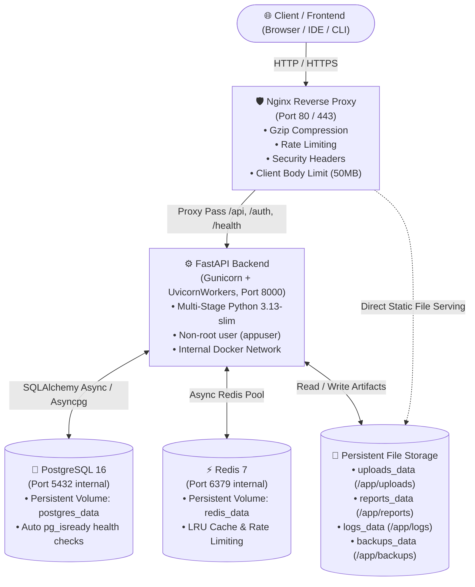

# CodePilot AI — Production Deployment & Docker Guide

Comprehensive guide for deploying, operating, and maintaining **CodePilot AI** using Docker, Docker Compose, PostgreSQL, Redis, and Nginx. This guide supports both **Windows (Docker Desktop)** and **Linux (Cloud VPS / Ubuntu)** environments.

---

## 🏗️ Architecture Overview



---

## 📁 Directory Structure

```text
code-review-agent/
├── Dockerfile                  # Multi-stage production build (Python 3.13-slim, non-root)
├── docker-compose.yml          # Development environment (bind mounts, dev ports)
├── docker-compose.prod.yml     # Production environment (hardened, internal ports only)
├── .dockerignore               # Build context filter (excludes secrets, venv, caches)
├── .env.example                # Template with all configurable parameters
├── .env.production             # Hardened production environment template
├── gunicorn_conf.py            # Gunicorn configuration with UvicornWorker
├── nginx/
│   ├── nginx.conf              # Global Nginx tuning, gzip, buffers, rate zones
│   ├── default.conf            # Virtual host, reverse proxy upstream, security headers
│   └── mime.types              # MIME types definition
├── scripts/
│   ├── start.sh                # Container entrypoint (DB wait -> Redis wait -> migrate -> Gunicorn)
│   ├── wait_for_db.sh          # PostgreSQL availability poller (pg_isready)
│   ├── migrate.sh              # Automatic Alembic migration runner
│   ├── healthcheck.sh          # 5-point system diagnostic health script
│   ├── backup_db.sh            # Automated timestamped gzip pg_dump backup
│   ├── restore_db.sh           # Safe database drop, recreate, and restore script
│   ├── cleanup_uploads.sh      # Expiration cleanup for temporary uploads and logs
│   ├── backup_db.ps1           # Windows PowerShell database backup
│   ├── restore_db.ps1          # Windows PowerShell database restore
│   ├── docker_manage.ps1       # Windows PowerShell Docker lifecycle wrapper
│   └── run_tests.ps1           # Automated test suite runner (Phases 1-11)
├── backups/                    # Database dumps (.sql / .sql.gz)
├── uploads/                    # User source code uploads and temporary archives
├── reports/                    # Generated review deliverables (JSON, Markdown, HTML, ZIP)
├── logs/                       # Rotating application, Gunicorn, and access logs
└── docs/
    └── deployment.md           # This deployment manual
```

---

## 🚀 1. Local Development Setup (Docker)

### Prerequisites
* **Windows**: [Docker Desktop](https://www.docker.com/products/docker-desktop/) (WSL2 backend enabled)
* **Linux / macOS**: Docker 24.0+ and Docker Compose v2.20+

### Step-by-Step
1. **Clone repository and configure environment**:
   ```bash
   cp .env.example .env
   ```
   *(On Windows PowerShell)*:
   ```powershell
   Copy-Item .env.example .env
   ```

2. **Build and start services**:
   ```bash
   docker compose up --build -d
   ```
   *(Or using the PowerShell management helper)*:
   ```powershell
   .\scripts\docker_manage.ps1 -Action build
   ```

3. **Verify running containers**:
   ```bash
   docker compose ps
   ```
   You should see 4 healthy containers:
   * `codepilot_nginx` (Ports: `0.0.0.0:80->80/tcp`)
   * `codepilot_backend` (Ports: `0.0.0.0:8000->8000/tcp`)
   * `codepilot_postgres` (Ports: `0.0.0.0:5433->5432/tcp`)
   * `codepilot_redis` (Ports: `0.0.0.0:6380->6379/tcp`)

4. **Verify application health**:
   * Through Nginx: [http://localhost/health](http://localhost/health)
   * Direct Backend: [http://localhost:8000/health](http://localhost:8000/health)
   * Interactive Swagger UI: [http://localhost/docs](http://localhost/docs)
   * Prometheus Metrics: [http://localhost/metrics](http://localhost/metrics)

---

## 🏭 2. Production Deployment Setup

### Step-by-Step for Cloud VPS (Ubuntu 22.04 / 24.04 LTS)

1. **Install Docker Engine & Compose**:
   ```bash
   curl -fsSL https://get.docker.com -o get-docker.sh
   sudo sh get-docker.sh
   sudo usermod -aG docker $USER
   newgrp docker
   ```

2. **Prepare Environment File**:
   ```bash
   cp .env.production .env.production
   chmod 600 .env.production
   nano .env.production
   ```
   Ensure you replace:
   * `SECRET_KEY` with a freshly generated secret (`openssl rand -hex 32`)
   * `DATABASE_PASSWORD` with a strong 32+ character passphrase
   * `REDIS_PASSWORD` with a secure password
   * `GEMINI_API_KEY` with your active Google Gemini key
   * `WEBHOOK_SECRET` with an HMAC secret

3. **Launch Production Stack**:
   ```bash
   docker compose -f docker-compose.prod.yml up -d --build
   ```

4. **Monitor Startup Logs**:
   ```bash
   docker compose -f docker-compose.prod.yml logs -f backend
   ```
   The backend container will automatically:
   1. Poll and wait for PostgreSQL to become fully ready.
   2. Verify connectivity with Redis.
   3. Execute `alembic upgrade head` to apply all migrations.
   4. Spawn `gunicorn` with multiple `UvicornWorker` processes.

---

## 🗄️ 3. Database Migrations

Database migrations execute **automatically** on container boot via `scripts/start.sh` -> `scripts/migrate.sh`.

### Manual Migration Commands

* **Apply pending migrations**:
  ```bash
  docker compose exec backend alembic upgrade head
  ```
  *(PowerShell)*:
  ```powershell
  .\scripts\docker_manage.ps1 -Action migrate
  ```

* **Inspect current revision**:
  ```bash
  docker compose exec backend alembic current
  ```

* **View revision history**:
  ```bash
  docker compose exec backend alembic history --verbose
  ```

* **Rollback one migration**:
  ```bash
  docker compose exec backend alembic downgrade -1
  ```

---

## 💾 4. Database Backups & Restores

### Automated Backup (Linux VPS)
Run the backup script directly on the host or inside the container:
```bash
# Inside running backend container
docker compose exec backend /app/scripts/backup_db.sh

# Or directly from host
./scripts/backup_db.sh
```
* Backups are written to `backups/codepilot_<db>_<timestamp>.sql.gz`.
* Backups older than 7 days are automatically rotated.

### Automated Backup (Windows / Docker Desktop)
```powershell
.\scripts\backup_db.ps1 -RetentionDays 7
```

### Database Restore (Linux VPS)
```bash
# Restore latest available backup:
docker compose exec backend /app/scripts/restore_db.sh

# Restore specific backup file:
docker compose exec backend /app/scripts/restore_db.sh /app/backups/codepilot_codepilot_db_20260928_120000.sql.gz
```

### Database Restore (Windows / Docker Desktop)
```powershell
# Restore latest backup:
.\scripts\restore_db.ps1

# Restore specific backup without interactive prompt:
.\scripts\restore_db.ps1 -BackupFile .\backups\codepilot_codepilot_db_20260928_120000.sql -Force
```

---

## 🧹 5. Automated Storage & Temp File Cleanup

To prevent disk exhaustion from large ZIP archives or old log files, run `scripts/cleanup_uploads.sh`:

```bash
# Dry run to preview what would be deleted
docker compose exec backend env DRY_RUN=true /app/scripts/cleanup_uploads.sh

# Perform actual cleanup
docker compose exec backend /app/scripts/cleanup_uploads.sh
```

### Scheduled Cron Job (Production VPS)
Add to system crontab (`crontab -e`):
```cron
# Daily database backup at 02:00 UTC
0 2 * * * cd /opt/code-review-agent && ./scripts/backup_db.sh >> /var/log/codepilot_backup.log 2>&1

# Hourly temp file cleanup
0 * * * * cd /opt/code-review-agent && docker compose exec -T backend /app/scripts/cleanup_uploads.sh >> /var/log/codepilot_cleanup.log 2>&1
```

---

## 🩺 6. Health Checks & Verification

### Built-in 5-Point Health Probe
Run the containerized health check script:
```bash
docker compose exec backend /app/scripts/healthcheck.sh
```
*(PowerShell)*:
```powershell
.\scripts\docker_manage.ps1 -Action health
```

This verifies:
1. `[PASS]` Application HTTP endpoint (`/health`)
2. `[PASS]` PostgreSQL database readiness (`pg_isready`)
3. `[PASS]` Redis cache responsiveness (`redis-cli ping`)
4. `[PASS]` File uploads directory write permissions
5. `[PASS]` Reports directory write permissions

### Running the Test Suite Inside Docker
To validate end-to-end correctness inside the container environment:
```bash
# Run all 116 tests inside backend container
docker compose exec backend pytest
```
*(PowerShell)*:
```powershell
.\scripts\docker_manage.ps1 -Action test
```

---

## 🔒 7. Security Hardening Checklist for Production

* [x] **Non-Root Execution**: Backend runs as unprivileged user `appuser:appgroup` (UID 1001).
* [x] **Internal Networking**: Database and Redis ports are only accessible inside Docker bridge network `codepilot_net`.
* [x] **Strict Security Headers**: Nginx enforces `X-Frame-Options`, `X-Content-Type-Options`, `Strict-Transport-Security`, and `Referrer-Policy`.
* [x] **Server Tokens Disabled**: `server_tokens off` hides Nginx version banner.
* [x] **Client Upload Quotas**: Nginx limits upload body to 50MB (`client_max_body_size 50m`).
* [x] **Rate Limiting**: Nginx applies IP-based rate limiting on `/api/` (60r/m) and `/auth/` (10r/m).
* [x] **Production Documentation Toggle**: Set `ENABLE_DOCS=false` in `.env.production` to deactivate public Swagger `/docs` and `/redoc` interfaces in production.
* [x] **CORS Origin Whitelisting**: Strict `CORS_ORIGINS` prevents unauthorized cross-origin browser requests.

---

## ❓ 8. Troubleshooting & FAQ

### Issue: Port 80 or 5432 is already in use
* **Cause**: Another service (IIS, Apache, local PostgreSQL) is bound to the port.
* **Solution**:
  - In `docker-compose.yml`, change host port mappings:
    - Postgres: `"5433:5432"` (already default in dev compose)
    - Redis: `"6380:6379"` (already default in dev compose)
    - Nginx: `"8080:80"` (change `- "80:80"` to `- "8080:80"` if port 80 is occupied)

### Issue: Backend container fails with `pg_isready` timeout
* **Cause**: PostgreSQL is taking longer than 60s to initialize or credentials do not match.
* **Solution**: Check postgres container logs:
  ```bash
  docker compose logs postgres
  ```
  Ensure `POSTGRES_USER` and `POSTGRES_PASSWORD` match between `backend` and `postgres` services.

### Issue: `alembic` migration error `Can't locate revision identified by '...'`
* **Cause**: Migration versions folder mismatch.
* **Solution**: Ensure `./alembic/versions` is mounted or copied in Dockerfile. Run:
  ```bash
  docker compose exec backend alembic current
  docker compose exec backend alembic upgrade head
  ```
