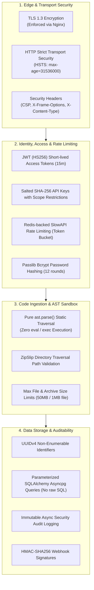

# CodePilot AI — Comprehensive Security & Threat Mitigation Specification

## 1. Security Architecture Overview

**CodePilot AI** is built on defense-in-depth principles across the edge, transport, application, and persistence tiers. Because the system ingests, parses, and analyzes potentially untrusted third-party source code, stringent isolation and security controls are enforced to prevent Remote Code Execution (RCE), ZipSlip file overwrite, and privilege escalation.



---

## 2. Authentication & Credential Security

### 2.1 JWT (JSON Web Tokens)
* **Algorithm**: HMAC-SHA256 (`HS256`) using a strong secret key (`SECRET_KEY`).
* **Lifespans**:
  * `access_token`: 15 minutes (ephemeral, minimizing exposure window).
  * `refresh_token`: 7 days (stored encrypted or securely in HTTP-only cookies).
* **Token Invalidation**: Logouts push tokens to a Redis blacklist with a TTL matching the token's remaining validity duration.

### 2.2 API Keys for CI/CD & Automation
* API keys are formatted as `cp_live_<prefix>_<random_secret>`.
* **Database Storage**: The server stores only the SHA-256 hash of the key (`hashed_key`). The raw plaintext secret is displayed to the user **once** upon generation and never stored or logged.
* **Scoping**: API keys support granular permissions (e.g. `["reviews:read", "reviews:create", "reports:export"]`).

### 2.3 Password Hashing
* Passwords are encrypted using **Passlib** with **Bcrypt** algorithm and an adaptive work factor (12 salt rounds).
* Passwords never exist in plaintext memory beyond authentication verification.

---

## 3. Rate Limiting & Abuse Prevention

Distributed rate limiting is enforced via **SlowAPI** backed by **Redis**:
* **Authentication Endpoints (`/auth/login`, `/auth/register`)**: 5 requests per minute per IP address (brute-force defense).
* **AI Analysis Endpoints (`/ai/review`, `/ai/explain`)**: 20 requests per minute per authenticated user/key (prevents LLM quota exhaustion).
* **Static Analysis Endpoints (`/review/text`)**: 60 requests per minute per IP address.
* **Archive Uploads (`/upload/archive`)**: 10 uploads per hour per user.
* When rate limits are tripped, the API responds with `HTTP 429 Too Many Requests` and a standard `Retry-After` header.

---

## 4. Security Headers & Edge Protection

Nginx and FastAPI middleware enforce strict HTTP response headers:

| Header | Configured Value | Security Purpose |
| :--- | :--- | :--- |
| `Content-Security-Policy` | `default-src 'self'; script-src 'self'; style-src 'self' 'unsafe-inline'; img-src 'self' data:;` | Mitigates Cross-Site Scripting (XSS) |
| `X-Frame-Options` | `DENY` | Prevents Clickjacking attacks |
| `X-Content-Type-Options` | `nosniff` | Blocks MIME-type sniffing |
| `Strict-Transport-Security` | `max-age=31536000; includeSubDomains; preload` | Enforces HTTPS connections |
| `Referrer-Policy` | `strict-origin-when-cross-origin` | Protects sensitive URL query parameters |
| `Permissions-Policy` | `geolocation=(), camera=(), microphone=()` | Disables unnecessary browser capabilities |

---

## 5. Safe Code Ingestion & Sandboxing

CodePilot AI processes raw code submitted by developers. To eliminate arbitrary execution risks:
1. **Zero Execution Policy**: User code is **never executed**. It is parsed purely into an AST data structure via Python's standard `ast.parse()`.
2. **ZipSlip Defense**: When extracting uploaded ZIP / TAR archives, the target extraction path is validated to guarantee it does not escape the designated temporary directory:
   ```python
   target_path = os.path.abspath(os.path.join(dest_dir, member.filename))
   if not target_path.startswith(os.path.abspath(dest_dir) + os.sep):
       raise SecurityException("ZipSlip path traversal attempt detected!")
   ```
3. **Payload Clamping**:
   * Single file maximum: 1 MB.
   * Archive maximum: 50 MB.
   * Nginx `client_max_body_size` set to 50M.

---

## 6. Webhook Delivery Security

Outbound notifications sent to external URLs use **HMAC-SHA256** signatures:
1. The webhook body is serialized to JSON.
2. A cryptographic signature is generated using the user's shared webhook secret:
   $$\text{Signature} = \text{HMAC-SHA256}(\text{Secret}, \text{Payload})$$
3. Injected into the HTTP header:
   ```http
   X-CodePilot-Signature: sha256=d58d8...
   X-CodePilot-Event: review.completed
   ```
4. Webhook destinations are validated to reject local loopback (`127.0.0.1`, `localhost`) and private subnet IPs (`10.0.0.0/8`, `192.168.0.0/16`) to eliminate Server-Side Request Forgery (SSRF).

---

## 7. Audit Trail & Non-Repudiation

Security-critical actions are recorded in the `audit_logs` PostgreSQL table:
* User registration, login, logout, password change
* API key provisioning, access, and revocation
* Source code uploads and batch job submissions
* Review deletions (soft-delete preserves record)
* Webhook trigger events

Audit records capture: `user_id`, `action`, `resource`, `resource_id`, `ip_address`, `user_agent`, `status`, `metadata_json`, and UTC `timestamp`.

---

## 8. OWASP Top 10 Mitigation Matrix

| OWASP Vulnerability | Risk Level | CodePilot AI Mitigation Strategy |
| :--- | :--- | :--- |
| **A01: Broken Access Control** | High | Role-Based Access Control (Admin/User), UUIDv4 keys, row-level ownership validation in repositories. |
| **A02: Cryptographic Failures** | High | Passlib Bcrypt (12 rounds), TLS 1.3 enforced, salted SHA-256 for API keys, HS256 for JWTs. |
| **A03: Injection (SQL / Command)** | High | SQLAlchemy parameterized queries, zero dynamic SQL, pure AST parsing with no code evaluation. |
| **A04: Insecure Design** | Medium | Clean architecture layering, rate limiting on all endpoints, quota guards on AI inferences. |
| **A05: Security Misconfiguration** | Medium | Docker multi-stage non-root container, minimal attack surface, all debug modes disabled in production. |
| **A06: Vulnerable Components** | Medium | Pip-audit and Bandit in CI/CD pipeline, Dependabot automated daily security updates. |
| **A07: Identification & Auth** | High | Short-lived JWTs (15 min), brute-force rate limits (5 req/min on login), password complexity rules. |
| **A08: Software & Data Integrity** | Medium | SHA-256 integrity checksums for all uploaded files, HMAC-SHA256 signed webhooks. |
| **A09: Logging & Monitoring** | Low | Async immutable audit logging, Prometheus metrics, multi-stage health probes. |
| **A10: SSRF** | Medium | Webhook URL validator blocks loopback (`127.0.0.1`), LAN subnets, and non-HTTP/HTTPS schemes. |

---

*Document Version: 1.0.0 — Security Specification.*
