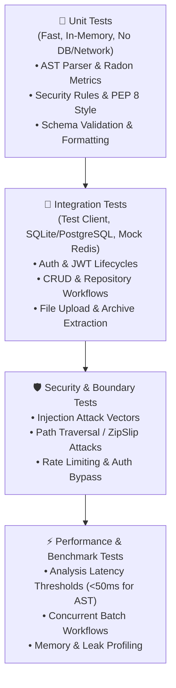

# CodePilot AI — Comprehensive Testing & Quality Assurance Guide

## 1. Testing Philosophy & Test Hierarchy

**CodePilot AI** maintains a multi-tiered test suite ensuring deterministic correctness, high test coverage (>80%), zero external network dependency during testing, and strict regression prevention.



---

## 2. Test Suite Directory Breakdown

```text
tests/
├── conftest.py             # Global pytest fixtures, async event loops, test client
├── utils.py                # Helper assertions, test token generators
├── fixtures/               # Reusable mock responses and code snippets
├── factories/              # FactoryBoy / Polyfactory data model factories
├── mocks/
│   ├── gemini_mock.py      # Deterministic Gemini AI responses & quota simulation
│   ├── redis_mock.py       # In-memory async Redis dictionary mock
│   └── webhook_mock.py     # HTTP mock for webhook delivery validation
├── unit/                   # Unit test suite for core algorithms & parsers
├── integration/            # API router & database integration test suite
├── security/               # Vulnerability scanning, ZipSlip, and auth test suite
├── performance/            # High-load stress tests & latency assertions
└── sample_files/           # Python files with intentional bugs & clean references
```

---

## 3. Mocking Infrastructure

### 3.1 Mocking Google Gemini AI (`tests/mocks/gemini_mock.py`)
To prevent token consumption, network flakiness, and rate limit errors during testing, all AI calls are intercepted by `MockGeminiClient`:
* Returns deterministic JSON structures matching `ReviewReport` and `AIReviewResponse`.
* Supports simulating API errors (e.g. `QuotaExceededError`, `TimeoutError`, invalid JSON responses) to verify fallback logic.
* Activated automatically via `mock_gemini` fixture in `conftest.py`.

```python
# Example: Injecting Gemini Mock in a Test
@pytest.mark.asyncio
async def test_ai_review_fallback(client, mock_gemini):
    mock_gemini.set_simulate_error(True)
    response = await client.post("/ai/review", json={"code": "print('hello')", "language": "python"})
    assert response.status_code == 200
    assert "fallback" in response.json()["model_used"].lower()
```

### 3.2 Mocking Redis (`tests/mocks/redis_mock.py`)
The `MockRedis` class provides an async-compatible in-memory store simulating:
* Key-value operations (`get`, `set`, `delete`, `expire`, `exists`)
* SlowAPI rate-limiting sliding windows
* Hash sets and token blacklists

```python
# Example: Testing Redis Cache Hit
@pytest.mark.asyncio
async def test_cache_hit(client, mock_redis):
    # First request: Cache Miss
    res1 = await client.post("/review/text", json={"code": "x = 10", "language": "python"})
    assert res1.headers.get("X-Cache") != "HIT"

    # Second identical request: Cache Hit
    res2 = await client.post("/review/text", json={"code": "x = 10", "language": "python"})
    assert res2.headers.get("X-Cache") == "HIT"
```

---

## 4. Running Tests with PowerShell

CodePilot AI includes an automated test runner script `scripts/test.ps1` that automatically resolves the virtual environment and supports multiple test targets:

```powershell
# 1. Run All Test Suites with Coverage Report
.\scripts\test.ps1 -Type all

# 2. Run Only Unit Tests (Fastest, ~3 seconds)
.\scripts\test.ps1 -Type unit

# 3. Run Integration Tests (Requires mock DB/Redis)
.\scripts\test.ps1 -Type integration

# 4. Run Security Vulnerability Tests
.\scripts\test.ps1 -Type security

# 5. Run Performance & Latency Benchmark Tests
.\scripts\test.ps1 -Type performance

# 6. Generate HTML Coverage Report
.\scripts\test.ps1 -Type all -HtmlReport
```

---

## 5. Running Tests with Standard Pytest & Bash

```bash
# Run tests with terminal coverage summary
pytest --cov=app --cov-report=term-missing tests/

# Run with fail-fast flag (stop on first failure)
pytest -x tests/

# Run specific test file
pytest tests/unit/test_analyzer.py

# Run specific test function
pytest tests/unit/test_analyzer.py -k "test_syntax_error"

# Generate XML coverage report for CI
pytest --cov=app --cov-report=xml:coverage.xml tests/
```

---

## 6. Coverage Targets & Quality Gates

The CI/CD pipeline enforces the following coverage thresholds:

| Module / Layer | Target Coverage | Enforced Gate |
| :--- | :--- | :--- |
| `app/ai/analyzer.py` (AST Engine) | 95%+ | 90% Minimum |
| `app/ai/security.py` (Vulnerability AST) | 90%+ | 85% Minimum |
| `app/core/security.py` (Auth & Tokens) | 95%+ | 90% Minimum |
| `app/api/` (API Routers) | 85%+ | 80% Minimum |
| **Total Codebase Coverage** | **85%+** | **80% Minimum** |

---

*Document Version: 1.0.0 — Testing & Quality Assurance Guide.*
